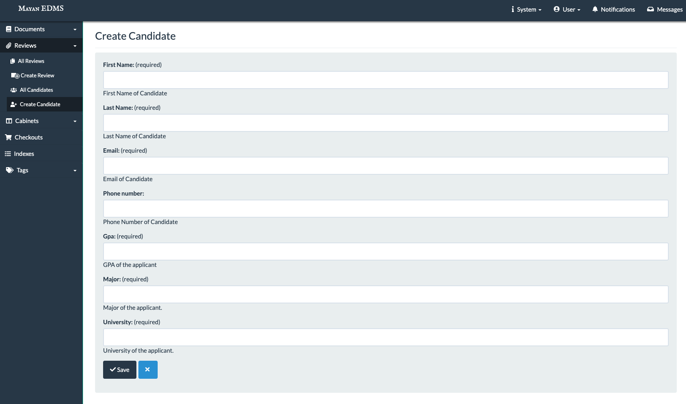
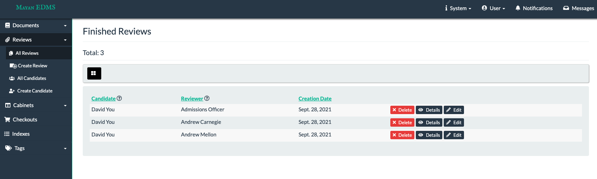
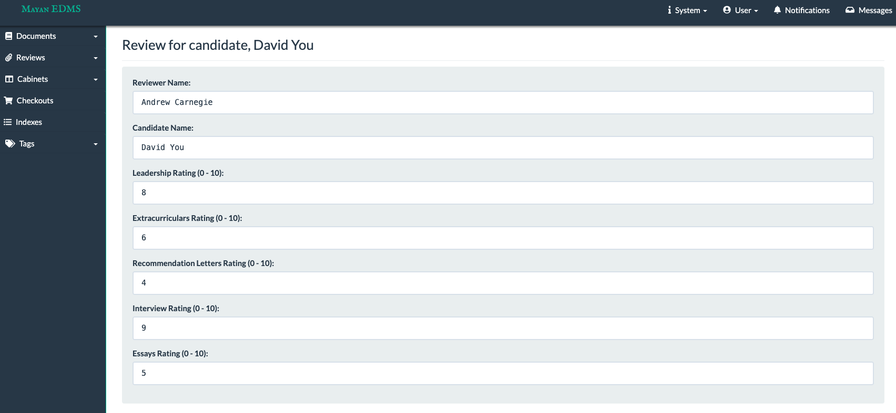

[![pypi][pypi]][pypi-url]
![python][python]
![license][license]

[![Commits][commits]][commits-url]
[![Support][support]][support-url]

[pypi]: https://img.shields.io/pypi/v/mayan-edms.svg
[pypi-url]: https://pypi.org/project/mayan-edms/

[builds]: https://gitlab.com/mayan-edms/mayan-edms/badges/master/build.svg
[builds-url]: https://gitlab.com/mayan-edms/mayan-edms/pipelines

[python]: https://img.shields.io/pypi/pyversions/mayan-edms.svg
[python-url]: https://img.shields.io/pypi/l/mayan-edms.svg?style=flat

[license]: https://img.shields.io/pypi/l/mayan-edms.svg?style=flat
[license-url]: https://gitlab.com/mayan-edms/mayan-edms/blob/master/LICENSE

[commits]:  https://img.shields.io/github/commit-activity/y/mayan-edms/mayan-edms.svg
[commits-url]: https://gitlab.com/mayan-edms/mayan-edms/

[support]: https://img.shields.io/badge/Get_support-brightgreen
[support-url]: https://www.mayan-edms.com/support/

  
   
   
  

    Mayan EDMS is a document management system. Its main purpose is to store,
    introspect, and categorize files, with a strong emphasis on preserving the
    contextual and business information of documents. It can also OCR, preview,
    label, sign, send, and receive thoses files. Other features of interest
    are its workflow system, role based access control, and REST API.
  

    

<h2 align="center">Book</h2>

The final version of the book "Exploring Mayan EDMS" available now!

    

The link is https://sellfy.com/p/um2fkx/

<h2 align="center">Installation</h2>

The easiest way to use Mayan EDMS is by using the official
[Docker](https://www.docker.com/) image. Make sure Docker is properly installed
and working before attempting to install Mayan EDMS.

For the complete set of installation instructions visit the Mayan EDMS documentation
at: https://docs.mayan-edms.com/parts/installation.html

<h2 align="center">Hardware requirements</h2>

- 2 Gigabytes of RAM (1 Gigabyte if OCR is turned off).
- Multiple core CPU (64 bit, faster than 1 GHz recommended).

<h2 align="center">Important links</h2>

- [Homepage](http://www.mayan-edms.com)
- [Documentation](https://docs.mayan-edms.com)
- [Contributing](https://gitlab.com/mayan-edms/mayan-edms/blob/master/CONTRIBUTING.md)
- [Forum](https://forum.mayan-edms.com/)
- [Source code, issues, bugs](https://gitlab.com/mayan-edms/mayan-edms)
- [Plug-ins, other related projects](https://gitlab.com/mayan-edms/)
- [Translations](https://www.transifex.com/rosarior/mayan-edms/)
- [Videos](https://www.youtube.com/channel/UCJOOXHP1MJ9lVA7d8ZTlHPw)

<h2 align="center">Additional Features</h2>

For HW2, we decided to implemenet feature 2: a form for reviewers to enter and score candidates 
along various directions. All code can be found in the `mayan/apps/reviews` folder. Our feature 
consists of two main components: reviews and candidates. On the side navigation, we have an addition
<b>reviews</b> tab that gives three options:

1. <b>Create Review</b>: This page allows the user to create a new review for an established candidate
2. <b>Create Candidate</b>: This page allows the user to add a new candidate to the database
3. <b>All</b>: This page showcases all the different reviews for a specific candidate

All additional tests can be found in `mayan/apps/reviews/tests`. These tests run automatically with GitHub actions. 

<h3 align="left">Create Candidate</h3>

  In order to create any reviews, the database must have candidates. These candidates have all their required information
  stored into the system. The user inputs their information in here with the listed requirements. All fields except the phone number
  are required.

Figure 1: Candidate Creation Page

<h3 align="left">Create Review</h3>

  Once a candidate has been created, the user is able to write a review for them. The reviewer has a set criteria discussed beforehand
  that is used to rate the candidate. Each criteria ranges from 0 - 10, with 0 being the lowest and 10 being the highest. 

Figure 2: Individual Candidate Review Creation Page

<h3 align="left">All</h3>

  Once a candidate has been created, they will be added to the <b>All</b> page where all reviews for all candidates are stored. Users can see the results for
  each candidate by clicking on that specific review to find the candidate, reviewer, and the scores for each criteria.

Figure 3: View of Candidates with their Reviewer

Figure 4: View of Individual Candidate

